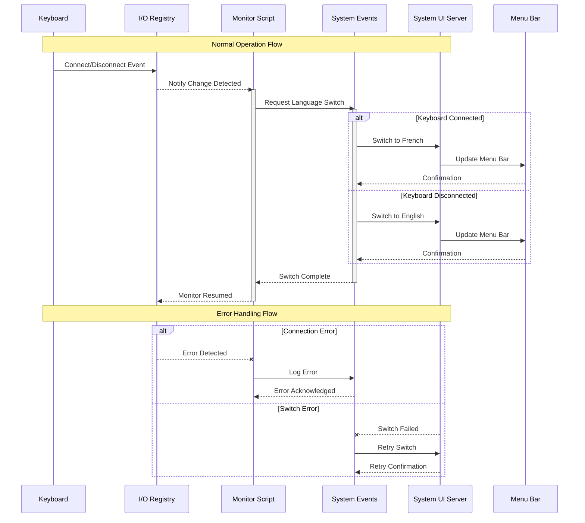

# Keyboard Input Language Switch

## 💻 Keyboard Detection Process

1. **Detection Location**: The system monitors the I/O Registry database located at `/usr/sbin/ioreg`
2. **Registry Path**: Keyboard entries appear under:

   ```plaintext
   IOService:/AppleACPIPlatformExpert/PCI0@0/AppleACPIPCI/RP04@1/IOPP/GFX0@0/IGPU@2/AppleBacklightDisplay-33-2101-11000000/GFX0@0/IGPU@2/AppleBacklightDisplay-33-2101-11000000/pci-bridge@1/IOPP/UPSB@0/AppleUSBXHCI/LNB0@0/AppleUSBXHCIPort@1/Logitech MX Mechanical
   ```

## 🔄 Language Switching Flow

1. **Detection Trigger**: When the keyboard connects/disconnects, macOS updates its I/O Registry
2. **System Response**: The change triggers our monitoring script through System Events
3. **Switch Location**: Language switching occurs through the System UI Server process



The diagram above illustrates the complete flow, where:

- Vertical bars show when each component is actively processing
- Solid arrows represent successful operations
- Dashed arrows indicate error responses
- The System Events layer acts as a bridge between monitoring and UI updates

## ℹ️ Technical Implementation Details

Here's exactly where each component processes the keyboard events and language switches:

```plaintext
# Keyboard detection occurs in:
/usr/sbin/ioreg -l | grep IORegistryEntrySearch

# Language switching happens through:
/System/Library/CoreServices/System Events.app
/System/Library/CoreServices/SystemUIServer.app
```

### ⚙️ Implementation Steps

1. **Create the AppleScript Solution**:

   ```shell
   # Test
   osascript ~/Library/Scripts/com.wind.keyboardwatcher.applescript
   # Copy AppleScript
   # cp com.wind.keyboardwatcher.applescript ~/Library/Scripts/
   # Copy AppleScript
   cp com.wind.keyboardwatcher.applescript /Library/Scripts/
   # Permissions
   sudo chown root:wheel /Library/Scripts/com.wind.keyboardwatcher.applescript
   sudo chmod +x "$(dirname /Library/Scripts/com.wind.keyboardwatcher.applescript)"
   sudo chmod +x /Library/Scripts/com.wind.keyboardwatcher.applescript
   ```

   ```mermaid
   flowchart TD
       Start[Start] --> Init["Initialize Variables"]
       Init --> CheckKB["Check Keyboard State"]
       CheckKB --> Found{Found?}
       Found -->|Yes| ProcessConn["Process Connected"]
       Found -->|No| ProcessDisconn["Process Disconnected"]
       ProcessConn --> Log["Write to Log File"]
       ProcessDisconn --> Log

       subgraph "Common Error Points"
           direction TB
           E1["Variable Naming Issues"]
           E2["Parameter Syntax Errors"]
           E3["File Access Problems"]
       end

       Log -.->|"Can Trigger"| E1
       Log -.->|"Can Trigger"| E2
       Log -.->|"Can Trigger"| E3
    ```

2. **Set up the LaunchAgent Configuration**:

   ```shell
   # Lint
   # plutil -lint com.wind.keyboardwatcher.plist
   # Copy plist configuration
   # cp com.wind.keyboardwatcher.plist ~/Library/LaunchAgents/
   # Load the agent
   # launchctl load ~/Library/LaunchAgents/com.wind.keyboardwatcher.plist
   # Unload the agent
   # launchctl unload ~/Library/LaunchAgents/com.wind.keyboardwatcher.plist

   # Copy plist configuration
   cp com.wind.keyboardwatcher.plist /Library/LaunchDaemons/
   # Load the agent
   sudo launchctl bootstrap system /Library/LaunchDaemons/com.wind.keyboardwatcher.plist
   # Permissions
   sudo chown root:wheel /Library/LaunchDaemons/com.wind.keyboardwatcher.plist
   sudo chmod 644 /Library/LaunchDaemons/com.wind.keyboardwatcher.plist
   # Unload the agent
   # sudo launchctl disable system/com.wind.keyboardwatcher
   # sudo launchctl remove com.wind.keyboardwatcher

   # Verify status
   launchctl list | grep com.wind.keyboardwatcher
   # Check logs
   log show --last 1m --predicate 'process == "osascript"'
   log show --last 1m --predicate 'process == "launchd"'
   log show --last 1m --predicate 'process == "launchd" AND subsystem CONTAINS "com.wind.keyboardwatcher"'
   log show --last 1m --predicate 'process == "launchd"' --info | grep --color com.wind.keyboardwatcher

   # View process status
   ps aux | grep com.wind.keyboardwatcher
   # Monitor CPU usage
   top | grep osascript
   # Check memory usage
   ps -o rss,cmd -p $(pgrep osascript)
   ```

### 📍 Error Handling Locations

1. **Connection Errors** are logged in: `/var/log/system.log`
2. **Switch Errors** are handled by: `/System/Library/CoreServices/System Events.app/Contents/MacOS/System Events`
